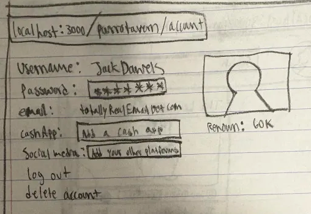

# ParroTavern

## Overview

Bored of playing the same old formulaic DND campaigns? Running out of ideas to please your bored adventures? Or maybe you you just want to hear stories from people more interesting than you? Then grab a chair and Ale and listen to people regale at The Parro Tavern!

ParroTavern is a web app that allows users to digitally keep track of and share to the world their DND campaign (or any story similar to WattPad). Each user may choose to create a campaign and will be presented with options to fill it with campaign elements. These elements are designed to make following the story easy for anybody who views them, as they'll contain any pictures or information about the story a user may want to add. So, once logged in, a user may use ParroTaverns tools to make a easy and aesthetically pleasing page that contains a main story and helpful tabs on the side with extra details to make visualizing the story easier than ever. Of course, on the other hand, users can also freely view other people's campaigns. They can upvote their favorite campaigns and even support the creators by donating through any link the user provides!


## Data Model

The application will store Users, Campaigns, and Campaign Elements (This can include Characters, Enemies, Locations, Items, and Story) 

* Users can have multiple campaigns (via references)
* Each campaign can have multiple Campaign Elements (via references) and multiple player users (via references), but one Dungeon Master user (via reference)
* Campaign Elements can have viewer users and editor users (via references)

An Example User:

```javascript
{
  username: "JackDaniels"
  hashedPassword: //a password hash
  email: fakeEmail@fakeEmail.com
  cashApp: totallyNotPatreonDotComURL
  socialMedia: www.fakeTwitterAccountDotComURL
  campaigns: [campaign_ID1, campaign_ID2, campaign_ID3]
}
```

An Example Campaign:

```javascript
{
  campaignName: "The Legend of Big Chungus"
  renown: 0
  campaignPassword: "peepee"     //no hashing because people mostly hack just steal private data
  dungeonMaster: jackDaniels_ID
  mainStory: ["long ago in a land before time..", "The 4 ninjas must retrive the golden weap...", "Lloyd! YOU are the gre..."]
  description: "Four prisoners break out through the sewers and find themselves at the temple of Chungus"
  tags: ["Romance", "Psychological Horror", "NSFW", "Gore", "Comedy", "Family-Friendly"]
  players: [player_ID1, player_ID2, player_ID3]
  renownSpreaders: [spreader_ID1, spreader_ID2, spreader_ID3]            //the dungeon master will not know this information
  campaignElements: [element_ID1, element_ID2, element_ID3]
}
```
An Example CampaignElement:

```javascript
{
  elementType: "character"
  private: false
  canSee: []                  //a player character. No restrictions needed on who can see (unless later necessary)
  canEdit: [player_ID1]       //only the player should be allowed to edit their sheet (Dungeon master by default has all priviledges though)
  elementText: "A blue jay/humanoid named Rordecai who loves playing video games and got arrested for accidentally burning down the park he works at"
  images: ["totallyRealRordecaiImageURL"]
}
```

## [Link to First Draft Schema](https://github.com/nyu-csci-ua-0467-001-002-spring-2025/final-project-Alok-Dumet/blob/master/db.mjs)(db.mjs) 

## Wireframes

/parrotavern/log-in - page for logging in


/parrotavern/register - page for registering


/parrotavern/home - page for viewing other peoples' campaigns


/parrotavern/account - page for viewing and changing account details



/parrotavern/my-campaigns - page for viewing your campaigns and choosing to delete or edit them


/parrotavern/create-campaign - page for creating a campaign


/parrotavern/slugForCampaignName - page for editing + viewing campaign (option to edit page will not be rendered if the user does not have permissions)


## Site map

Assume all pages can lead back to Home when pressing the ParroTavern Icon on the top left of each page


## User Stories or Use Cases
1. as non-registered user, I can register a new account with the site
2. as a user, I can log in to the site
3. as a user, I can delete my account
4. as a user, I can log out of my account
5. as a user, I can edit my account's details
6. as a user, I can create a campaign
7. as a player user, I can play a campaign
8. as a user, I can view a campaign
10. as a dungeon master user or player user with permissions, I can edit a campaign
11. as a user I can like a campaign //this feature along with subscribing or following a user may or may not be implemeneted

## Research Topics

* (5 points) Integrate user authentication
    * Passport.js is an authentication middleware for Node.js that can support different kinds of authentication strategies
    * Strategies include including username/password, JWT, and OAuth providers like Google and Facebook
    * I am more interested, specifcally, in using passport-local for username/password authentication
    * This is because it'll simplify authentication, so I won't have to write extra code to hash passwords, check for unique usernames, etc. 
* (6 points) React.js
    * React.js is a library for building user interfaces, specialized in creating reusable UI components
    * It uses a virtual DOM to update and render web applications
    * I'll use it because it'll let me add animations and let me drag and drop items (extremely necessary for users to easily look at the campaign elements)
    * Modules for these are framer-motion and (funnily enough) react-dnd.

## [Link to Initial Main Project File](app.mjs)

"# React_Conversion_Test" 
